# Markdown Issue Index

Generated by derive-tracker.wasm

## Ready Queue

No ready issues.

## Unresolved Issues

| ID | Status | Priority | Type | Assignee | Blocked by | Blocks | Title |
| --- | --- | ---: | --- | --- | --- | --- | --- |
| [ISS-001](ISS-001.md) | in_progress | 1 | epic | codex | ISS-003, ISS-005, ISS-007, ISS-009 | none | Complete static SVG CSS computed semantics |
| [ISS-028](ISS-028.md) | in_progress | 1 | epic | codex | ISS-032, ISS-033, ISS-034, ISS-035 | none | Replace the integer SVG renderer |
| [ISS-032](ISS-032.md) | in_progress | 1 | task | codex | none | ISS-028, ISS-033 | Rebuild strokes dashes and markers |
| [ISS-003](ISS-003.md) | open | 1 | bug | unassigned | ISS-012 | ISS-001, ISS-007 | Complete CSS-wide and inherited property behavior |
| [ISS-011](ISS-011.md) | blocked | 1 | task | unassigned | none | ISS-005 | Upstream complete CSS Color 3 parsing |
| [ISS-012](ISS-012.md) | blocked | 1 | task | unassigned | none | ISS-003 | Upstream expose custom-property resolution for extension values |
| [ISS-013](ISS-013.md) | blocked | 1 | bug | unassigned | none | ISS-009 | Upstream compute font-size from inherited custom properties |
| [ISS-033](ISS-033.md) | open | 1 | task | unassigned | ISS-032 | ISS-028, ISS-034 | Rebuild paint servers and raster images |
| [ISS-034](ISS-034.md) | open | 1 | task | unassigned | ISS-033 | ISS-028, ISS-035 | Migrate clipping masks filters and blending |
| [ISS-035](ISS-035.md) | open | 1 | task | unassigned | ISS-034 | ISS-028 | Cut over the rendering facade and remove the old rasterizer |
| [ISS-005](ISS-005.md) | open | 2 | feature | unassigned | ISS-011 | ISS-001, ISS-007 | Adapt mizchi/css color values to SVG paint |
| [ISS-007](ISS-007.md) | open | 2 | task | unassigned | ISS-003, ISS-005, ISS-009 | ISS-001 | Verify and document static CSS support |
| [ISS-009](ISS-009.md) | blocked | 2 | feature | codex | ISS-013 | ISS-001, ISS-007 | Parse text elements with computed font size |
| [ISS-026](ISS-026.md) | deferred | 3 | feature | unassigned | none | none | Resolve external SVG resource documents |
| [ISS-027](ISS-027.md) | deferred | 3 | task | unassigned | none | none | Align advanced Filter Effects numerical semantics |
| [ISS-008](ISS-008.md) | deferred | 4 | epic | unassigned | none | none | Design external and dynamic CSS integration |
| [ISS-020](ISS-020.md) | deferred | 4 | feature | unassigned | none | none | Validate pixel parity against pinned Chromium |

## Dependency Graph

```mermaid
graph TD
  ISS_001["ISS-001: Complete static SVG CSS computed semantics"]
  ISS_002["ISS-002: Centralize computed property metadata"]
  ISS_003["ISS-003: Complete CSS-wide and inherited property behavior"]
  ISS_004["ISS-004: Integrate gradient stops with the CSS cascade"]
  ISS_005["ISS-005: Adapt mizchi/css color values to SVG paint"]
  ISS_006["ISS-006: Complete the SVG element adapter for upstream selectors"]
  ISS_007["ISS-007: Verify and document static CSS support"]
  ISS_008["ISS-008: Design external and dynamic CSS integration"]
  ISS_009["ISS-009: Parse text elements with computed font size"]
  ISS_010["ISS-010: Adopt mizchi/css as the CSS engine"]
  ISS_011["ISS-011: Upstream complete CSS Color 3 parsing"]
  ISS_012["ISS-012: Upstream expose custom-property resolution for extension values"]
  ISS_013["ISS-013: Upstream compute font-size from inherited custom properties"]
  ISS_014["ISS-014: Align opacity and isolated compositing with browsers"]
  ISS_015["ISS-015: Implement SVG filter graph evaluation"]
  ISS_016["ISS-016: Expand SVG filter primitive coverage"]
  ISS_017["ISS-017: Canonicalize basic geometry and curve coverage"]
  ISS_018["ISS-018: Unify stroke outline and dash rasterization"]
  ISS_019["ISS-019: Validate marker placement against normalized strokes"]
  ISS_020["ISS-020: Validate pixel parity against pinned Chromium"]
  ISS_021["ISS-021: Preserve affine primitive geometry during rasterization"]
  ISS_022["ISS-022: Preserve stroke outlines under general affine transforms"]
  ISS_023["ISS-023: Complete gradient and pattern paint-server semantics"]
  ISS_024["ISS-024: Add host-provided raster image resolution"]
  ISS_025["ISS-025: Repair viewport, use, clip, and mask transforms"]
  ISS_026["ISS-026: Resolve external SVG resource documents"]
  ISS_027["ISS-027: Align advanced Filter Effects numerical semantics"]
  ISS_028["ISS-028: Replace the integer SVG renderer"]
  ISS_029["ISS-029: Capture renderer baselines and contracts"]
  ISS_030["ISS-030: Introduce premultiplied rendering surfaces"]
  ISS_031["ISS-031: Rasterize continuous geometry into coverage"]
  ISS_032["ISS-032: Rebuild strokes dashes and markers"]
  ISS_033["ISS-033: Rebuild paint servers and raster images"]
  ISS_034["ISS-034: Migrate clipping masks filters and blending"]
  ISS_035["ISS-035: Cut over the rendering facade and remove the old rasterizer"]
  ISS_002 --> ISS_001
  ISS_003 --> ISS_001
  ISS_004 --> ISS_001
  ISS_005 --> ISS_001
  ISS_006 --> ISS_001
  ISS_007 --> ISS_001
  ISS_009 --> ISS_001
  ISS_010 --> ISS_001
  ISS_002 --> ISS_003
  ISS_010 --> ISS_003
  ISS_012 --> ISS_003
  ISS_002 --> ISS_004
  ISS_010 --> ISS_004
  ISS_002 --> ISS_005
  ISS_010 --> ISS_005
  ISS_011 --> ISS_005
  ISS_002 --> ISS_006
  ISS_010 --> ISS_006
  ISS_003 --> ISS_007
  ISS_004 --> ISS_007
  ISS_005 --> ISS_007
  ISS_006 --> ISS_007
  ISS_009 --> ISS_007
  ISS_010 --> ISS_009
  ISS_013 --> ISS_009
  ISS_014 --> ISS_015
  ISS_017 --> ISS_018
  ISS_018 --> ISS_019
  ISS_029 --> ISS_028
  ISS_030 --> ISS_028
  ISS_031 --> ISS_028
  ISS_032 --> ISS_028
  ISS_033 --> ISS_028
  ISS_034 --> ISS_028
  ISS_035 --> ISS_028
  ISS_029 --> ISS_030
  ISS_030 --> ISS_031
  ISS_031 --> ISS_032
  ISS_032 --> ISS_033
  ISS_033 --> ISS_034
  ISS_034 --> ISS_035
```

## Warnings

None.
